title: Collaborative Debugging and Fixing A 🐛 in Open Source
use_katex: False
class: title-slide

# Collaborative Debugging and Fixing A 🐛 in Open Source

.larger[Thomas J. Fan] 
@thomasjpfan 
<a href="https://www.github.com/thomasjpfan" target="_blank"></a>
<a href="https://www.twitter.com/thomasjpfan" target="_blank"></a>
<a class="this-talk-link", href="https://github.com/thomasjpfan/nyc-python-2020-lightning-hist-memory-issue" target="_blank">
This talk on Github: thomasjpfan/nyc-python-2020-lightning-hist-memory-issue</a>

---

class: center, middle

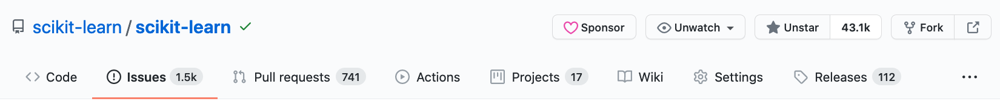

---

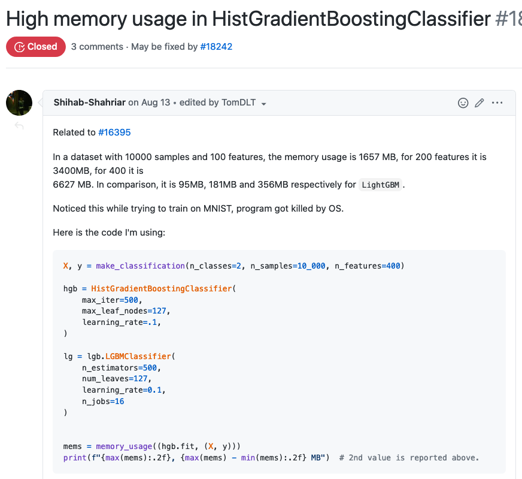

.footnote-back[https://github.com/scikit-learn/scikit-learn/issues/18152]

---

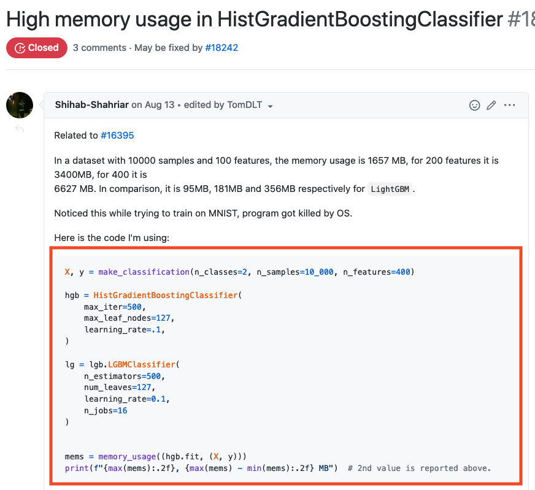

---

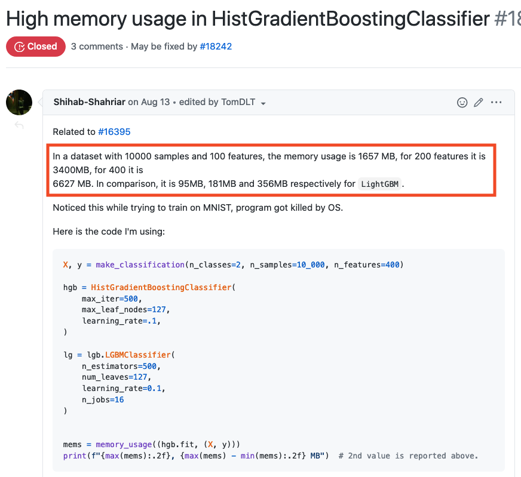

---

class: middle, center

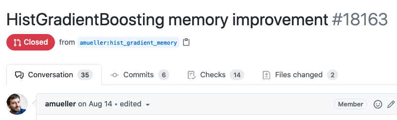
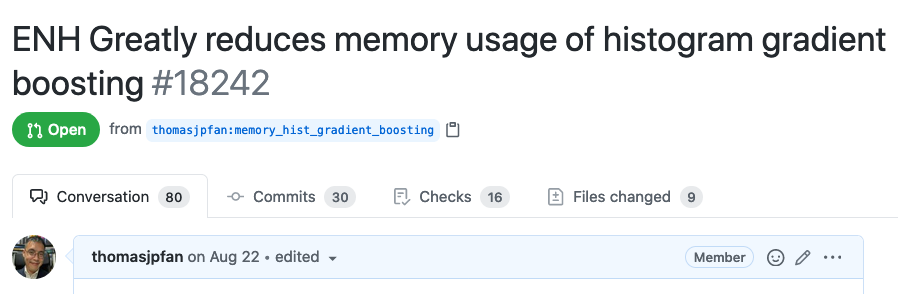
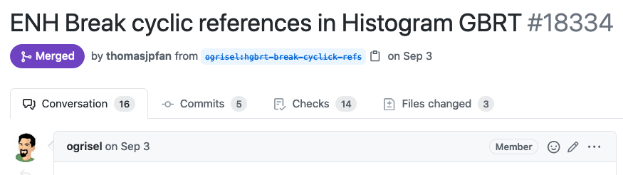

---

class: middle, center

# How did we choose the solution?

---

class: middle

---

class: center, middle

# Reference cycles

---

class: center, middle

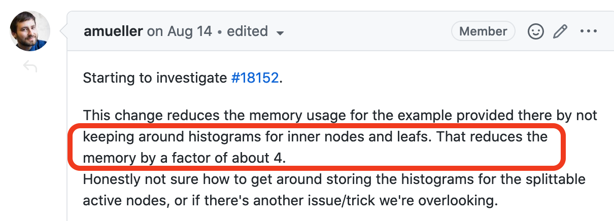

## 850 MB

---
class: middle, center

---

class: middle, center

---

class: middle, center

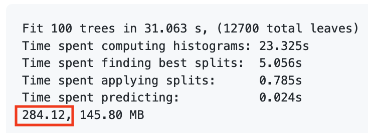

---

class: middle, center

---

class: middle, center

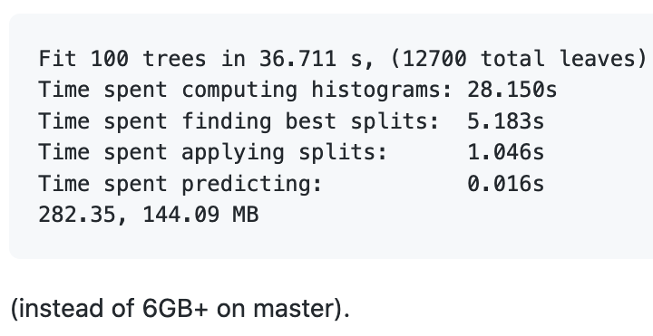

---

class: middle, center

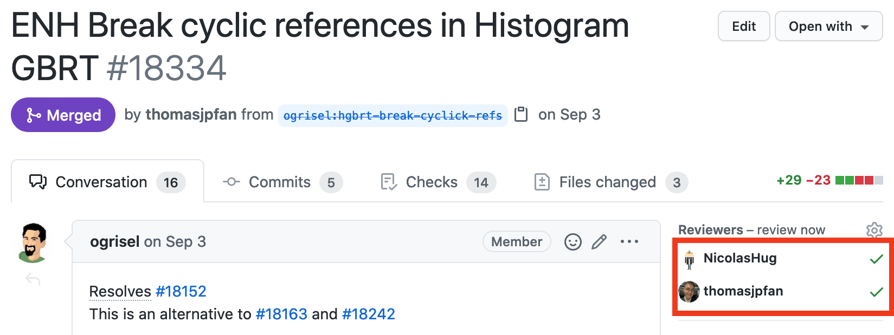

---

class: middle

.g.g-middle[
.g-8[
# Conclusion

- Bug report with reproducible code 🐛
- Many solutions based on different approaches 💻
- Picked solution based on benchmarking + maintainability 🪑
]
.g-4.g-center[
.larger[Thomas J. Fan] 
@thomasjpfan 
<a href="https://www.github.com/thomasjpfan" target="_blank"></a>
<a href="https://www.twitter.com/thomasjpfan" target="_blank"></a>
<a class="this-talk-link", href="https://github.com/thomasjpfan/nyc-python-2020-lightning-hist-memory-issue" target="_blank">
This talk on Github: thomasjpfan/nyc-python-2020-lightning-hist-memory-issue</a>
]
]
